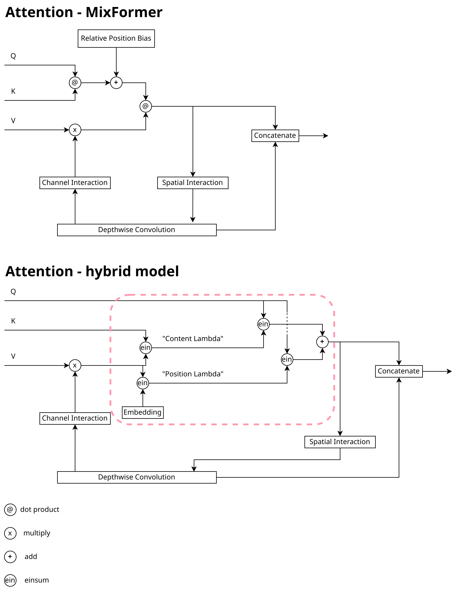
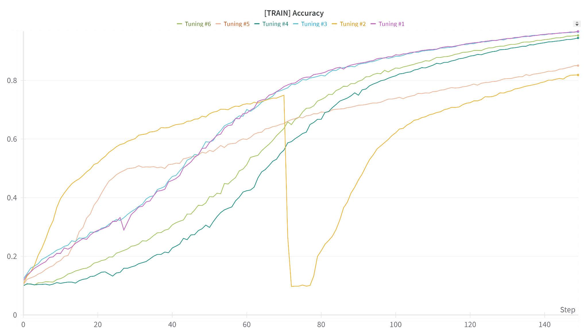
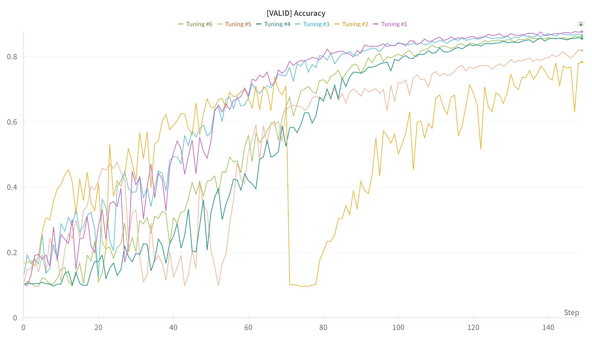
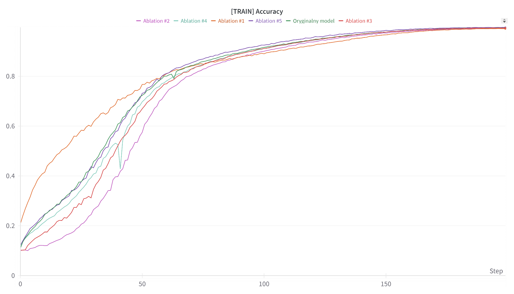
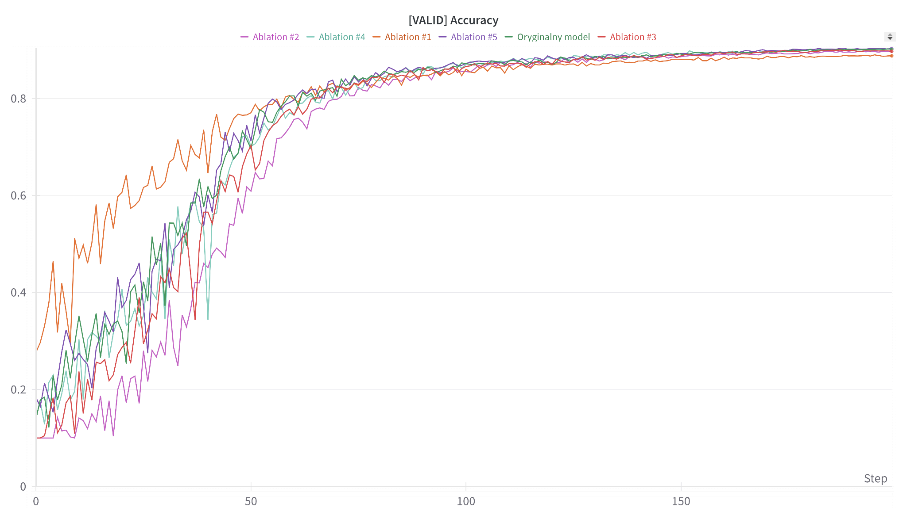

# MixFormer-LambdaNetworks Hybrid Model

This repository contains a PyTorch implementation of MixFormer, Lambda layers, and a hybrid model that combines both. The hybrid approach merges the MixFormer attention mechanism with the Lambda layer mechanism that uses `einsum` arithmetic for efficient attention calculations.

The modification of this hybrid model can be visualized below. The red box highlights the introduced changes.



## Model Overview
We used CIFAR10 dataset for our experiments.

### MixFormer
In MixFormer, the attention mechanism is implemented through the **MixingAttention** class, using a **window-based self-attention** technique. This method splits data into smaller windows, where attention is computed independently. Additionally, the **relative position bias**, a set of learnable parameters, is incorporated to consider the relative positions of elements in each window. This bias influences the final outcome of the attention calculations.

### Lambda Layers
In contrast to MixFormer, the attention mechanism in Lambda Layers relies on a different arithmetic approach. Using `einsum` operations, this mechanism does not partition data into windows, and therefore, the **relative position bias** is incompatible and unnecessary in this context. Instead, **embedding vectors** are used, which are learnable parameters that play a similar role in attention calculation as the relative position bias in MixFormer. In our hybrid model, these embeddings effectively replace the relative position bias.

## Usage

To run the project:
```bash
pip install -r requirements.txt
```
```bash
python main.py
```

## Hyperparameter Search

During the hyperparameter search, we focused on tuning the learning rate schedule using **Cosine Annealing**. Two strategies were tested:

1. **Linear Warm-up**: Gradually increasing the learning rate over `N` epochs to reach the base learning rate.
2. **Constant Warm-up**: Maintaining a constant learning rate for `N` warm-up epochs.

Tested hyperparameter configurations are presented in the table below:

| No. | Warm-up Type  | Warm-up Epochs | Warm-up Learning Rate | Base Learning Rate |
| --- | ------------- | -------------- | --------------------- | ------------------ |
| #1  | Constant      | 20             | 0.001                 | 0.001              |
| #2  | Constant      | 20             | 0.01                  | 0.01               |
| #3  | Constant      | 10             | 0.001                 | 0.001              |
| #4  | Linear        | 20             | 0.00001               | 0.001              |
| #5  | Linear        | 20             | 0.00001               | 0.01               |
| #6  | Linear        | 10             | 0.00001               | 0.001              |

Results from training during hyperparameter optimization for the training set.


Results from training during hyperparameter optimization for the validation set.


Based on the above results, configuration #1 turned out to be the best configuration, which is why it was used for conducting ablation study. Additionally, we can observe that for configuration #2, around epoch 70, there is a sudden drop in effectiveness; a similar situation occurs for configuration #5 around epoch 30. This situation is likely related to the use of too high an initial learning rate (0.01).

## Ablation Study

A key aspect of our hybrid model is the replacement of the attention module with Lambda Layers. We conducted ablation tests by reverting to the original MixFormer architecture and exploring other model variations. The tests are summarized below:

| No. | Ablation Test Description                                            |
| --- | -------------------------------------------------------------------- |
| #0  | Original hybrid model architecture                                   |
| #1  | Sequential connection of DwConv and Lambda Layer                     |
| #2  | No interaction between DwConv and Lambda Layer                       |
| #3  | No spatial interaction between DwConv and Lambda Layer               |
| #4  | No channel interaction between DwConv and Lambda Layer               |
| #5  | Original MixFormer model without relative position bias              |

The ablation test results on the test set showed minimal variations in accuracy, with the most effective configuration achieving **0.9031** accuracy. The comparison is presented in the table below:

| No. | Accuracy |
| --- | -------- |
| #0  | 0.9013   |
| #1  | 0.8879   |
| #2  | 0.8971   |
| #3  | 0.8973   |
| #4  | 0.9013   |
| #5  | 0.9031   |

Training accuracy over epochs for the training set.


Training accuracy over epochs for the validation set.


The hybrid model achieves faster training times due to its reduced parameter count while maintaining similar performance to the original MixFormer model.

## Model Parameters and Training Time

| Model                        | Parameters  | Training Time (200 epochs) |
| ----------------------------- | ----------- | -------------------------- |
| Hybrid                        | 27,712,930  | 2h 53m 46s                 |
| Hybrid (Ablation #1)          | 27,712,930  | 1h 42m 14s                 |
| Hybrid (Ablation #2)          | 27,712,930  | 2h 49m 54s                 |
| Original MixFormer            | 28,585,688  | 3h 2m 51s                  |

The hybrid model offers a notable reduction in the number of parameters, resulting in faster training times. Ablation #1 provides the best trade-off between training speed and accuracy.

## Conclusion
The hybrid MixFormer-Lambda Layer model provides comparable performance to the original MixFormer while reducing training time and memory usage. Depending on your priorities (accuracy vs. training time), this hybrid approach or specific ablations (such as #1) may offer significant benefits.

## References

docs
- [MixFormer: Mixing Features across Windows and Dimensions](https://arxiv.org/pdf/2204.02557v2.pdf)
- [LambdaNetworks: Modeling Long-Range Interactions Without Attention](https://arxiv.org/pdf/2102.08602.pdf)

code
- https://github.com/PaddlePaddle/PaddleClas/blob/bf5f021b0e9d162e77af86b5ba1604ab122c321e/ppcls/arch/backbone/model_zoo/mixformer.py (MixFormer implementation)
- https://github.com/joigalcar3/LambdaNetworks/tree/main (LambdaNetworks / Lambda layers implementation)